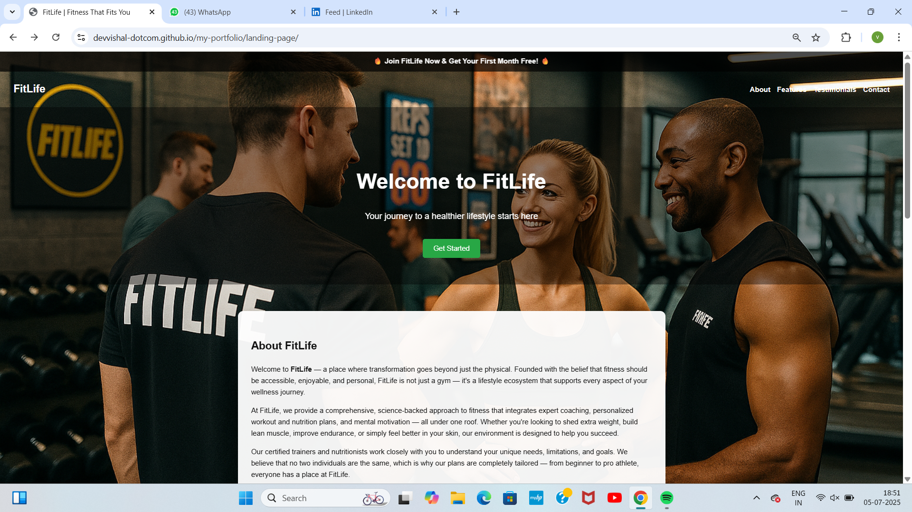
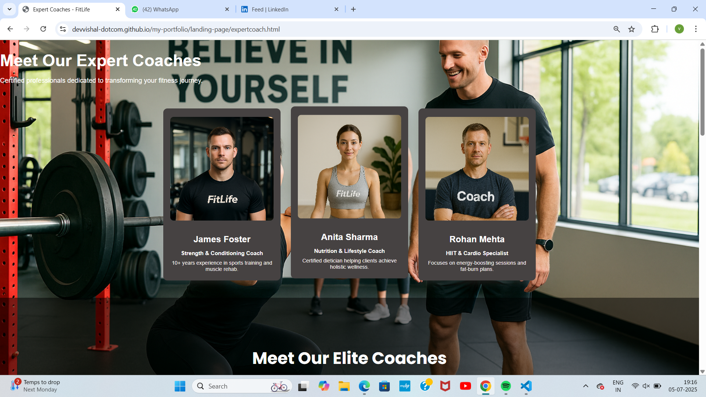
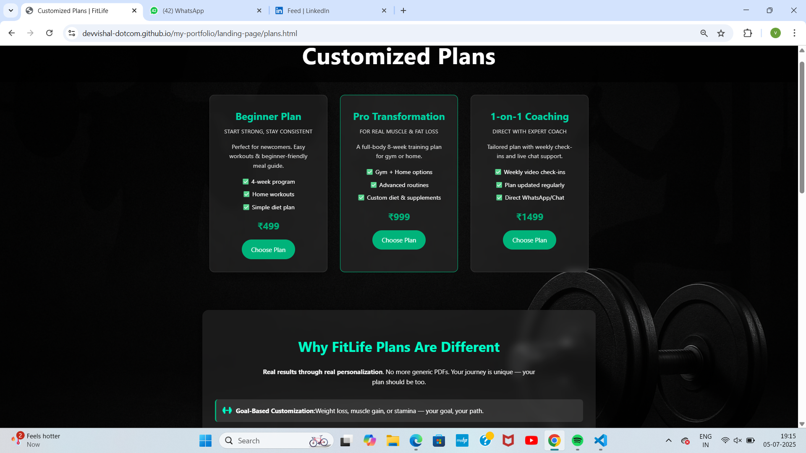
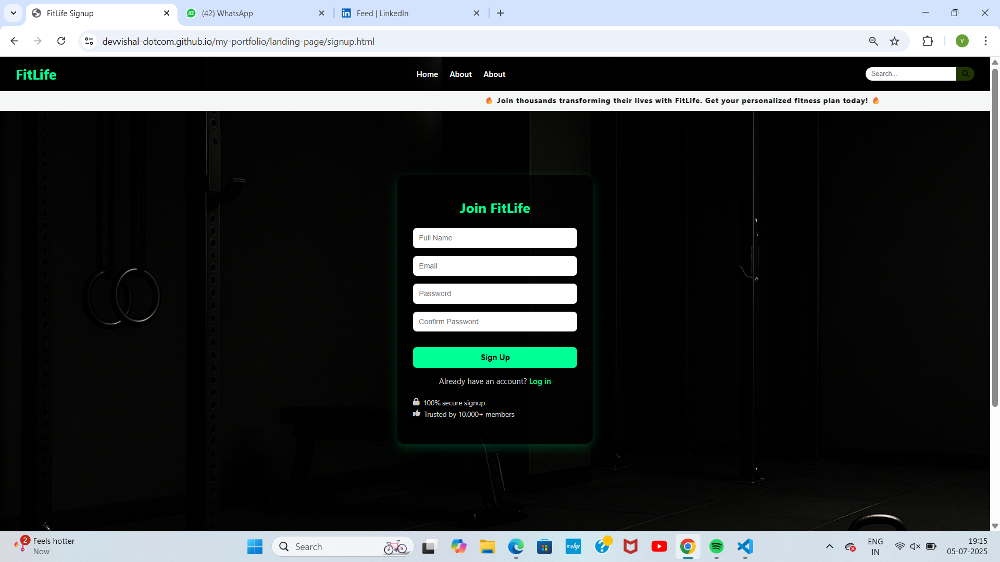

# 💪 FitLife – Multi-Page Fitness Landing Website

🚀 [Live Demo](https://devvishal-dotcom.github.io/my-portfolio/landing-page/)

FitLife is a fully responsive multi-page website designed for a fictional fitness brand. Created using HTML, CSS, and JavaScript, the site includes:

- 🏠 Home Page  
- 👨‍🏫 Expert Coaches Page  
- 📋 Fitness Plan Selection  
- 📝 User Sign-Up Form

## 💡 Skills Practiced:
- Responsive Design  
- Page structuring & smooth navigation  
- Clean UI/UX layout  
- Preparing for full-stack expansion (Laravel + MySQL soon!)

---

## 🔍 Preview

### 🏠 Home Page

### 👨‍🏫 Expert Coaches Page

### 📋 View Plans Page

### 📝 Sign-Up Page

---

Made with 💙 by Vishal Kumar Gupta
